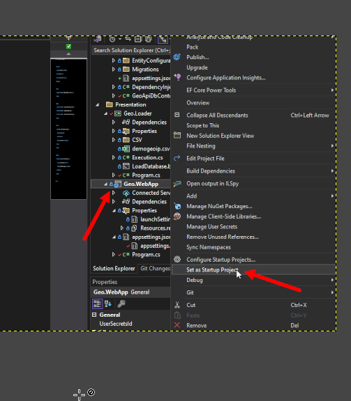

Запуск 
Запустить postgresql в docker при помощи StartDB.bat
Применить Миграции при помощи App-Update-Database.bat

Заполнить Базу данных при помощи Geo.Loader/LoadDatabase.bat
при необходимости заменив demogeoip.csv более полным [более полный csv](https://disk.yandex.ru/d/25HZsvfwVIIO4A)

сделать Geo.WebApp стартовым проектом

F5