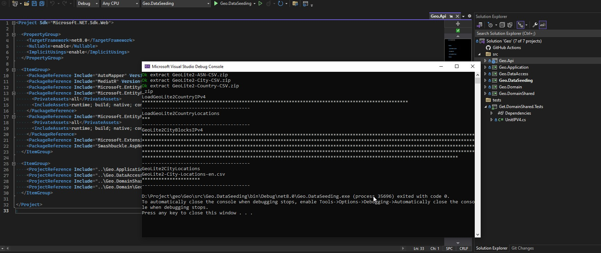
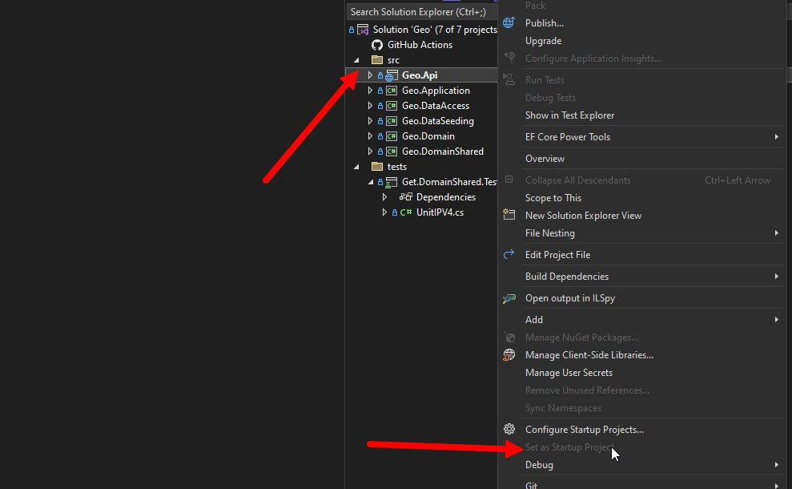

API 
#Сервис получения данных по IP адрессу
##Описание
на текущий момент подерживается только IPv4 

##Запуск 
Запустить postgresql в docker при помощи StartDB.bat
Применить Миграции при помощи App-Update-Database.bat

Выполнить посев данных при помощи Geo.DataSeeding сделав его стартовым проектом

F5

сделать Geo.Api стартовым проектом

Использовать API

