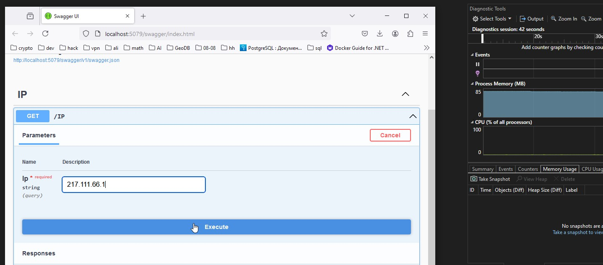

API 

#Сервис получения данных по IP адрессу

##Описание

на текущий момент подерживается только IPv4 

##Запуск 

Выполнить App-Docker-InstallOrReinstall-And-Start.bat
Дождатся открытия в браузере

Использовать API

